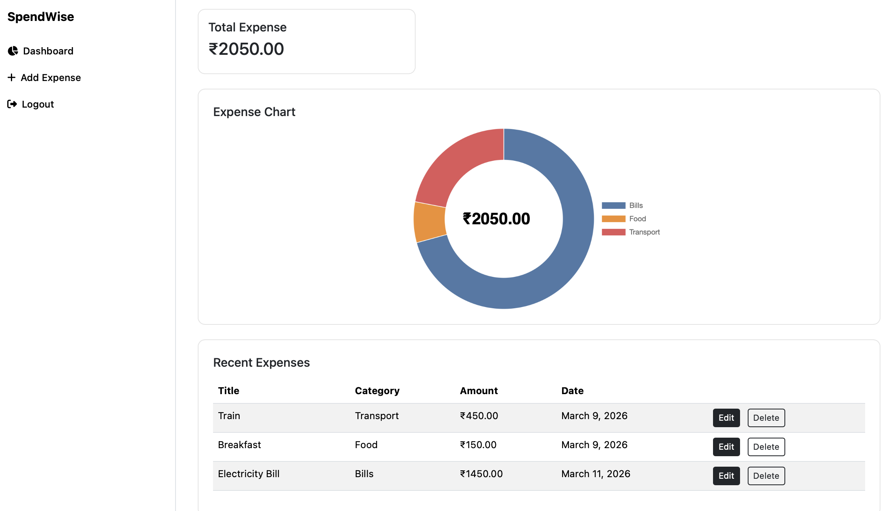
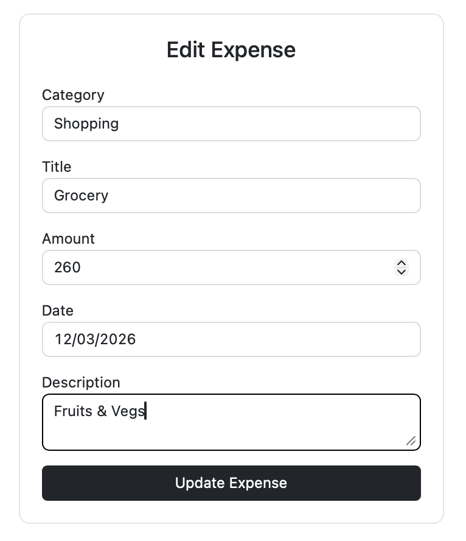
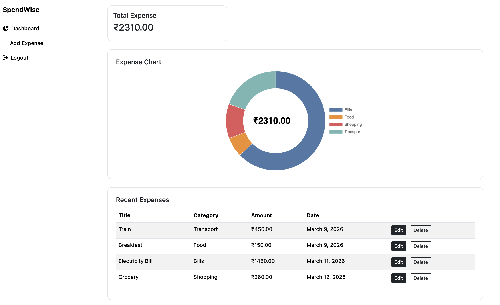

# SpendWise – Personal Expense Tracker

SpendWise is a full-stack Django web application that helps users track, manage, and analyze their personal expenses through an intuitive dashboard and analytics visualization.

The application supports secure authentication, expense management, category tracking, and financial insights through charts.

---

## 🚀 Features

### 🔐 Authentication
- User Registration
- Login & Logout
- Protected routes using Django authentication
- Session-based authentication

### 💰 Expense Management
- Add new expenses
- Edit existing expenses
- Delete expenses
- Categorize expenses

### 📊 Analytics Dashboard
- Total expense summary
- Category-wise expense visualization
- Interactive donut chart (Chart.js)

### 📱 Responsive UI
- Mobile-friendly interface
- Clean black & white minimal design
- Sidebar navigation dashboard

### 🛠 Backend
- Django framework
- PostgreSQL database
- Django ORM
- Secure user authentication

---

## 🧰 Tech Stack

| Layer | Technologies |
|---|---|
| **Backend** | Python, Django |
| **Database** | PostgreSQL |
| **Frontend** | HTML, CSS, Bootstrap, Chart.js |
| **Version Control** | Git, GitHub |

---

## 📂 Project Structure

```
spendwise/
│
├── expenses/
│   ├── migrations/
│   ├── models.py
│   ├── views.py
│   ├── forms.py
│   ├── urls.py
│
├── templates/
│   ├── base.html
│   ├── dashboard.html
│   ├── add_expense.html
│   ├── edit_expense.html
│   ├── login.html
│   └── register.html
│
├── spendwise/
│   ├── settings.py
│   └── urls.py
│
├── manage.py
├── requirements.txt
└── README.md
```

---

## ⚙️ Installation

### 1️⃣ Clone the repository

```bash
git clone https://github.com/Maaanav/spendwise-expense-tracker.git
cd spendwise-expense-tracker
```

### 2️⃣ Create virtual environment

```bash
python3 -m venv venv
```

Activate the environment:

**Mac / Linux**
```bash
source venv/bin/activate
```

**Windows**
```bash
venv\Scripts\activate
```

### 3️⃣ Install dependencies

```bash
pip install -r requirements.txt
```

### 4️⃣ Configure PostgreSQL

Create the database:

```sql
CREATE DATABASE spendwise_db;
```

Update the database configuration in `spendwise/settings.py`.

### 5️⃣ Run migrations

```bash
python manage.py migrate
```

### 6️⃣ Create admin user

```bash
python manage.py createsuperuser
```

### 7️⃣ Run the server

```bash
python manage.py runserver
```

Open in browser: [http://127.0.0.1:8000](http://127.0.0.1:8000)

---

## 📸 Screenshots

### Dashboard

Shows total expense summary and category-wise visualization.

### Expense Management


Users can add, edit, and delete expenses easily.

### Analytics



---

## 🔒 Security

- Passwords are hashed using Django's built-in authentication system
- Login required for dashboard and all expense management routes
- Users can only access their own expense data

---

## 📈 Future Improvements

- [ ] Monthly spending analytics
- [ ] Budget limit alerts
- [ ] Expense export to CSV
- [ ] Advanced filtering by date and category
- [ ] Dark mode support

---

## 👨‍💻 Author

**Manav Mangela**

GitHub: [https://github.com/Maaanav](https://github.com/Maaanav)

---

## ⭐ Contributing

Contributions are welcome! Feel free to fork the repository and submit pull requests.

---
